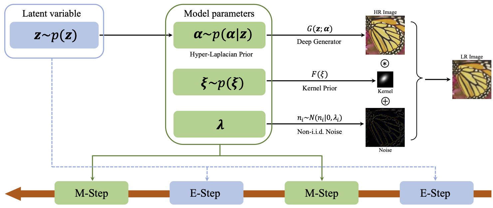
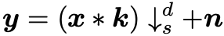

# Blind Image Super-resolution with Elaborate Degradation Modeling on Noise and Kernel (CVPR, 2022)

[](https://badge.fury.io/gh/zsyOAOA%2FBSRDM) 

This repository is the official PyTorch implementation of BSRDM with application to blind image super-resolution ([arXiv](https://arxiv.org/abs/2107.00986)).

---
>While researches on model-based blind single image super-resolution (SISR) have achieved tremendous successes recently, most of them do not consider the image degradation sufficiently. Firstly, they always assume image noise obeys an independent and identically distributed (i.i.d.) Gaussian or Laplacian distribution, which largely underestimates the complexity of real noise. Secondly, previous commonly-used kernel priors (e.g., normalization, sparsity) are not effective enough to guarantee a rational kernel solution, and thus degenerates the performance of subsequent SISR task. To address the above issues, this paper proposes a model-based blind SISR method under the probabilistic framework, which elaborately models image degradation from the perspectives of noise and blur kernel. Specifically, instead of the traditional i.i.d. noise assumption, a patch-based non-i.i.d. noise model is proposed to tackle the complicated real noise, expecting to increase the degrees of freedom of the model for noise representation. As for the blur kernel, we novelly construct a concise yet effective kernel generator, and plug it into the proposed blind SISR method as an explicit kernel prior (EKP). To solve the proposed model, a theoretically grounded Monte Carlo EM algorithm is specifically designed. Comprehensive experiments demonstrate the superiority of our method over current state-of-the-arts on synthetic and real datasets.
>

---
## Requirements
* Ubuntu 18.04, cuda 11.0
* Python 3.8.11, Pytorch 1.7.1
* More detail (See [environment.yml](environment.yml))

## Degradation Model
In the paper, we adopt the following degradation model: 

<p align="center"></p>
where k is the anisotropical Gaussian kernel.

* Kernel setting.
  
  To align the image, we can shift the kernel center toward the direction of upper-left or lower-right. It is controlled by the parameter ``kernel_shift'' in this [configuration file](./options/options1.json).
  
* Downsampling setting.

  We provide two kinds of downsampling method, namely direct or bicubic. One can specify it through the parameter ``downsampler'' in the configuration file.
  
Note that this [configuration file](./options/options1.json) contains all the hyper-parameters for our model, you can adjust it according to your need.

## Evaluation on Synthetic Data
1. The synthesized six blur kernels used in our paper can be obtained from [here](./testsets/kernels_synthetic). They are generated by this [manuscript](./testsets/gen_kernel_uniform.py).

2. To test BSRDM under camera sensor noise, run this command:

    ```
    python demo_synthetic.py --sf 2 --noise_type signal --noise_estimator niid 
    ```
    
    For the Gaussian noise, run this command:
    
    ```
    python demo_synthetic.py --sf 2 --noise_type Gaussian --noise_level 2.55
    ```

## Evaluation on Real Data
1. To test BSRDM on the [RealSRSet](https://github.com/cszn/BSRGAN/tree/main/testsets/RealSRSet), run this command by specifying your desired scale factor:
    
    ```
    python demo_real.py --sf 2
    ```
2. Note that in our paper we uniformly set the hyper-parameter \rho to be 0.2. In this manuscript, we adjust the settings of \rho for some images based on the visual results. And the suggested values for \rho is in the range [0.2, 0.4].

## License & Acknowledgement
This project is realeased under the GPL-3.0 license. The codes are based on [CBDNet](https://github.com/GuoShi28/CBDNet), [ResizeRight](https://github.com/assafshocher/ResizeRight), [DIP](https://github.com/DmitryUlyanov/deep-image-prior), and [FKP](https://github.com/JingyunLiang/FKP). Please also follow their licenses. Thanks for their great efforts.
